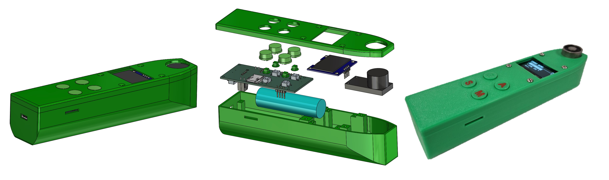
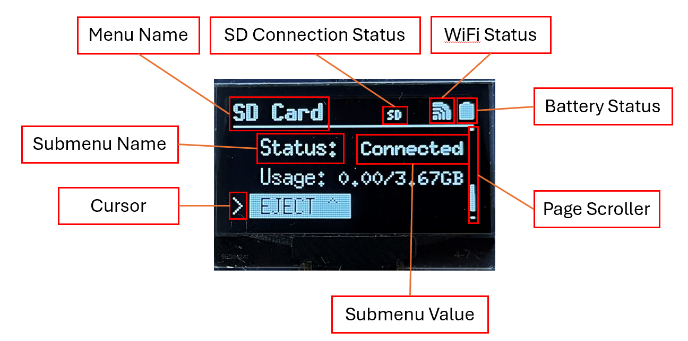
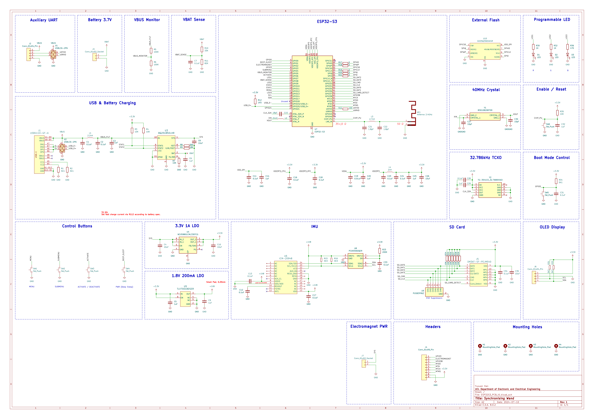
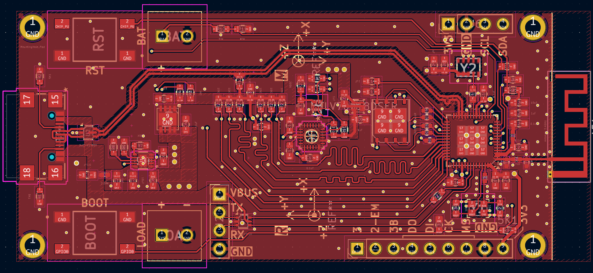
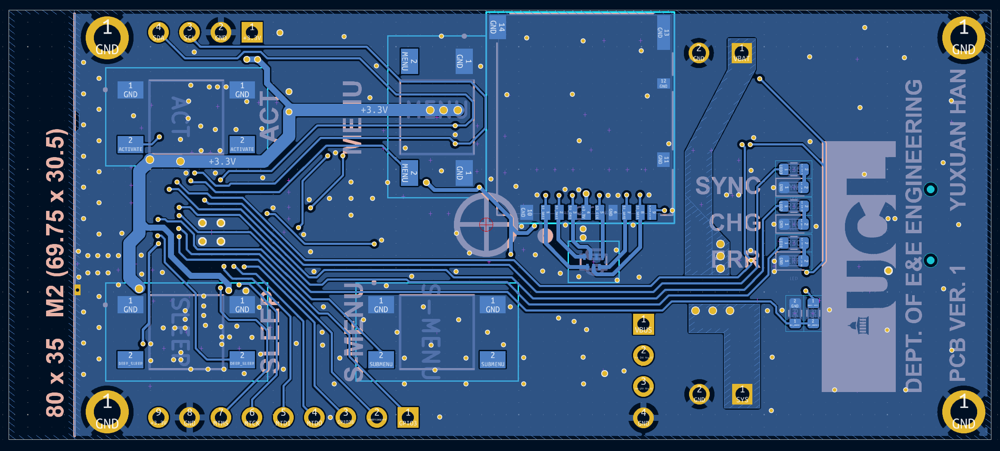

# Synchronising-Wand
- [Introduction](https://github.com/YuxuanHan0326/Synchronising-Wand#introduction)
- [3D Design Overview](https://github.com/YuxuanHan0326/Synchronising-Wand#3d-design-overview)
- [Screen Overview](https://github.com/YuxuanHan0326/Synchronising-Wand#screen-overview)
- [PCB Design](https://github.com/YuxuanHan0326/Synchronising-Wand#pcb-design)
- [Basic Controls](https://github.com/YuxuanHan0326/Synchronising-Wand#basic-control)
- [Flash the Firmware](https://github.com/YuxuanHan0326/Synchronising-Wand#flash-the-firmware)
- [Configure Parameters of the Firmware](https://github.com/YuxuanHan0326/Synchronising-Wand#configure-parameters-of-the-firmware)

## Introduction
The *Synchronising Wand* is an open-source hardware solution for synchronising multiple wireless inertial measurement unit sensors (IMU) using their onboard magnetometers. The device combines an ESP32-S3 micro-controller unit with an electromagnetic generator to create an encoded electromagnetic event which can be used to synchronise multiple IMU devices. The device also includes an onboard IMU, allowing the user to track the motion of the wand as well as perform a kinetic synchronising event.

The device includes an OLED display and 4 configuable push buttons for user interface to enhance the usability of the system. The device uses SD card as storage medium to store the synchronising data and onboard IMU data. WiFi is used to synchronise the RTC using SNTP from configurable NTP servers, e.g. *pool.ntp.org*.

## 3D Design Overview


## Screen Overview


## PCB Design
The PCB of the synchronising wand is designed using the open sourced PCB design software *KiCad*. The PCB files are completely open-sourced.

### Schematic


### Layout




### Stack-up Information
This device uses a 4 layer pcb, with a stack up of Signal-GND-GND-Signal.
The physical stack up of the pcb board is shown below:


## Basic Controls
- Press "MENU" button to switch between menus.
- Press "S-MENU" button to switch submenus.
- Press "ACT" button to activate / deactive functions.
- Long press for more than 4 seconds and release to put the device into deep sleep mode. Re-click the button to wake the device up.

**Note:**
Before performing IMU synchronisation or turning on onboard IMU, please make sure that WiFi is connected, time has been synchronised and SD card is plugged in and recognised.

To avoid data loss, the user should terminate the synchronisation group, turn off onboard IMU manually and use the *Eject* function under the *SD Card* menu before unplugging the SD card.

## Flash the Firmware
### Requirements
To change and rebuild the firmware, the Espressif's IoT Development Framework (ESP-IDF) is needed. Installation instructions for the latest version of the ESP-IDF can be found in [this documentation](https://docs.espressif.com/projects/esp-idf/en/latest/esp32/get-started/). The firmware is tested on ESP-IDF version 5.2.1.

### Build and Flash using UART
By default, the device can be flashed using UART. The user can connect the auxiliary UART pins to the computer through a USB-Serial converter. Ensure that the signal line voltage of the converter is set to 3.3V before connecting to the device.

With ESP-IDF on your `$PATH`, you can use `idf.py` to build the application from within this directory:

```bash
idf.py build
```

To flash the device, the user need to first set the device into bootloader mode:
1. Power up the device
2. Press and hold "BOOT" button
3. Click and release "RESET" button
4. Release "BOOT" button
The device will then be reset in bootloader mode and ready for flashing.

After properly configured the chip type and serial port number, the user can flash the firmware by using:
```bash
idf.py flash
```
When the flash complete message is shown up, click "RESET" to reset the device, and the flashing will complete.

### Monitor the device
By default, the device's log messages can be monitored by using UART. This can be achieved by typing the following command in the ESP-IDF terminal:
```bash
idf.py monitor
```

### Build and flash using DFU (Direct Firmware update) via USB 2.0 Full Speed
The device can also being build and flashed to the device via USB 2.0 full speed, but requires extra settings. Please navigate to [this documentation](https://docs.espressif.com/projects/esp-idf/en/latest/esp32s3/api-guides/dfu.html) for details.

## Configure Parameters of the Firmware
Currently, the parameters of the firmware (e.g. Synchronisation pulse properties, On board IMU configurations, etc.) can only be configured by changing the marcos in `user_config.h` and updated to the board by rebuilding and reflashing the firmware. We are currently developing the BLE and smartphone app which can be used to configure the parameters much easier.