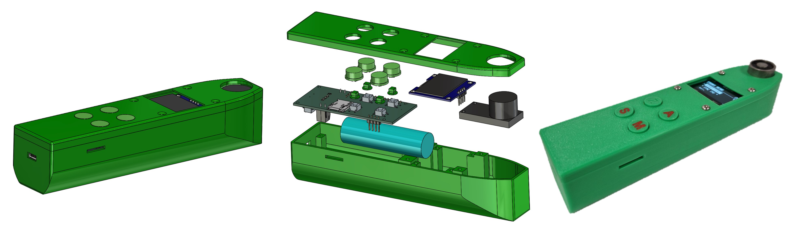
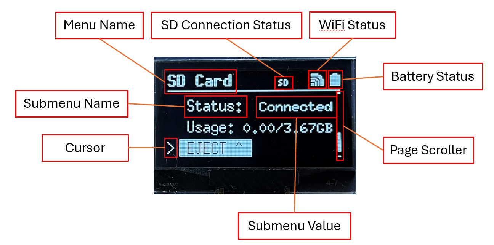
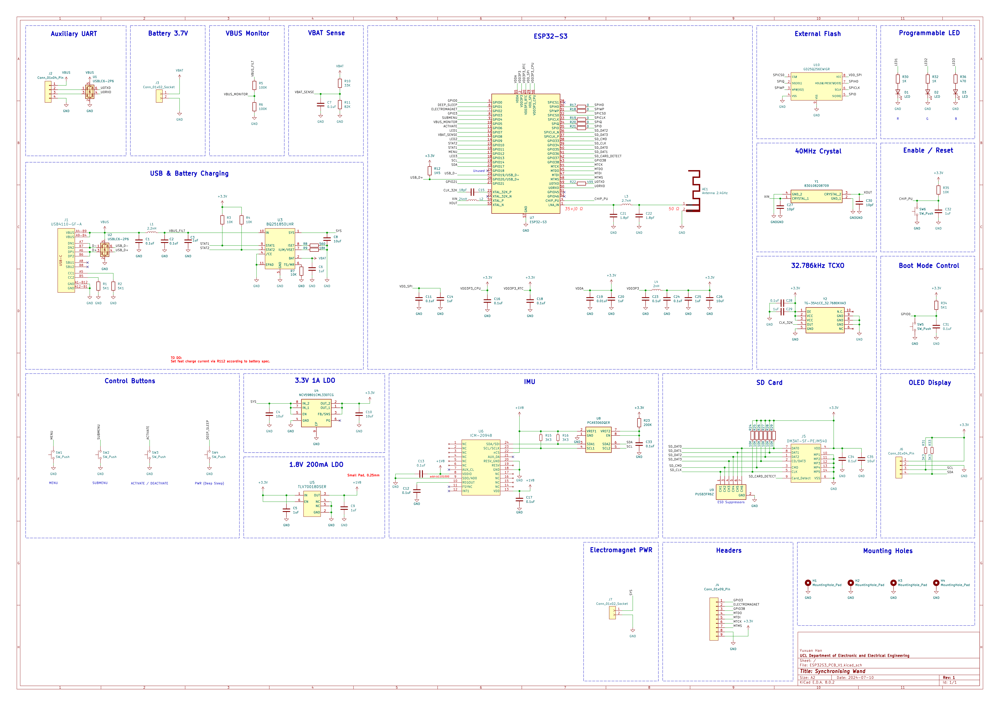
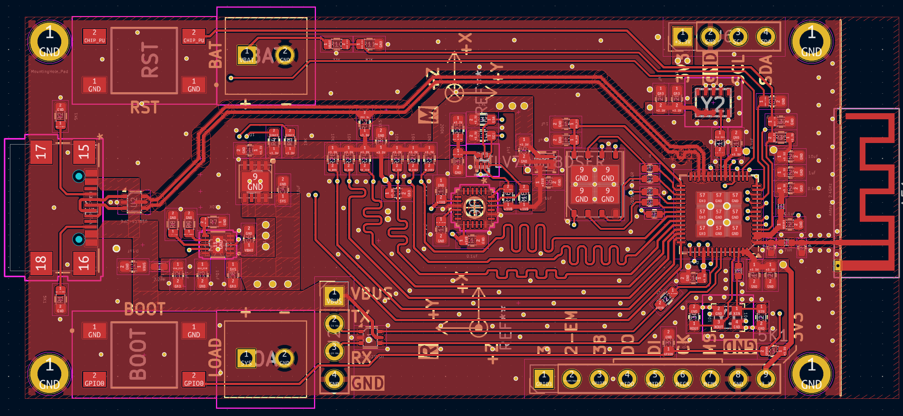
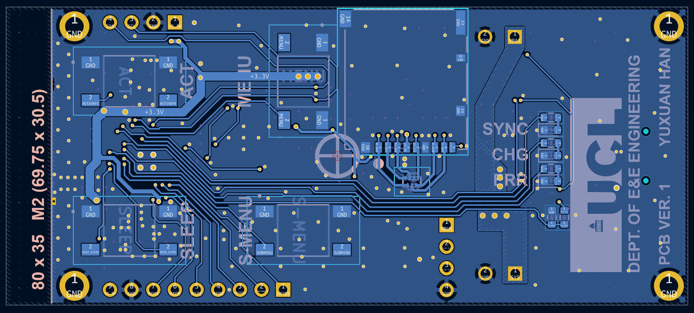
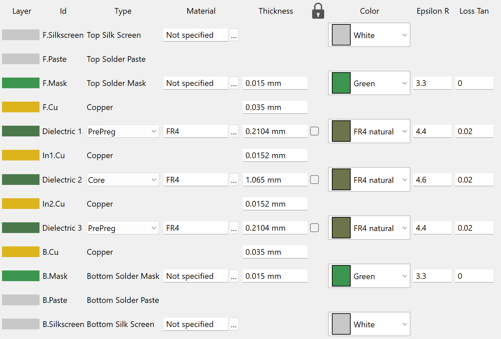

# Synchronisation-Wand
- [Introduction](https://github.com/YuxuanHan0326/Synchronisation-Wand?tab=readme-ov-file#introduction)
- [Related Publications](https://github.com/YuxuanHan0326/Synchronisation-Wand?tab=readme-ov-file#related-publications)
- [Project Files and Documentation](https://github.com/YuxuanHan0326/Synchronisation-Wand?tab=readme-ov-file#project-files-and-documentation)
- [3D Design Overview](https://github.com/YuxuanHan0326/Synchronisation-Wand?tab=readme-ov-file#3d-design-overview)
- [Screen Overview](https://github.com/YuxuanHan0326/Synchronisation-Wand?tab=readme-ov-file#screen-overview)
- [PCB Design](https://github.com/YuxuanHan0326/Synchronisation-Wand?tab=readme-ov-file#pcb-design)
- [Basic Controls](https://github.com/YuxuanHan0326/Synchronisation-Wand?tab=readme-ov-file#basic-controls)
- [Flash the Firmware](https://github.com/YuxuanHan0326/Synchronisation-Wand?tab=readme-ov-file#flash-the-firmware)
- [Configure Parameters of the Firmware](https://github.com/YuxuanHan0326/Synchronisation-Wand?tab=readme-ov-file#configure-parameters-of-the-firmware)

## Project Files and Documentation
This repository contains the Synchronisation Wand hardware and firmware, plus the verification platform for the encoded EMP synchronisation method. For fast access:
- [Synchronisation Wand Firmware](https://github.com/YuxuanHan0326/Synchronisation-Wand/tree/main/Firmware)
- [Synchronisation Wand PCB](https://github.com/YuxuanHan0326/Synchronisation-Wand/tree/main/PCB%20V1)
- [Data Processing Script for Verification Platform](https://github.com/YuxuanHan0326/Synchronisation-Wand/tree/main/Verification/DataProcessing/scripts)
- [Collected Source Data](https://github.com/YuxuanHan0326/Synchronisation-Wand/tree/main/Verification/DataProcessing/data)
- [Verilog Implementation Files for Testbed](https://github.com/YuxuanHan0326/Synchronisation-Wand/tree/main/Verification/Testbed/new_single_synchronisation.srcs/sources_1/new)
- [Final Report](./Resources/docs/Final_Report.pdf)
- [Presentation Poster](./Resources/docs/Presentation_Poster.pdf)

The related publication focuses mainly on the Synchronisation Wand device and hardware design. The final report is complementary and covers the verification platform, encoded EMP synchronisation verification, data processing workflow, and analysis in more detail. The presentation poster is a concise visual summary of the verification work.


## Introduction
The *Synchronisation Wand* is an open-source hardware solution for synchronising multiple wireless inertial measurement unit sensors (IMU) using their onboard magnetometers. The device combines an ESP32-S3 micro-controller unit with an electromagnetic generator to create an encoded electromagnetic event which can be used to synchronise multiple IMU devices. The device also includes an onboard IMU, allowing the user to track the motion of the wand as well as perform a kinetic synchronising event.

The device includes an OLED display and 4 configuable push buttons for user interface to enhance the usability of the system. The device uses SD card as storage medium to store the synchronising data and onboard IMU data. WiFi is used to synchronise the RTC using SNTP from configurable NTP servers, e.g. *pool.ntp.org*.

## Related Publications
For further detail of this project:

- [The Wand Chooses the IMU - Open Source Hardware for Synchronising Wearables using Magnetometer](https://dl.acm.org/doi/10.1145/3675094.3678485)

For how the electromagnetic synchronising method works:

- [A magnetometer-based method for in-situ syncing of wearable inertial measurement units](https://doi.org/10.3389/fcomp.2024.1385392)

## 3D Design Overview


## Screen Overview


## PCB Design
The PCB of the synchronisation wand is designed using the open sourced PCB design software *KiCad*. The PCB files are completely open-sourced.

### Schematic


### Layout




### Stack-up Information
This device uses a 4 layer pcb, with a stack up of Signal-GND-GND-Signal.
The physical stack up of the pcb board is shown below:


## Basic Controls
- Press "MENU" button to switch between menus.
- Press "S-MENU" button to switch submenus.
- Press "ACT" button to activate / deactive functions.
- Long press for more than 4 seconds and release to put the device into deep sleep mode. Re-click the button to wake the device up.

**Note:**
Before performing IMU synchronisation or turning on onboard IMU, please make sure that WiFi is connected, time has been synchronised and SD card is plugged in and recognised.

To avoid data loss, the user should terminate the synchronisation group, turn off onboard IMU manually and use the *Eject* function under the *SD Card* menu before unplugging the SD card.

## Flash the Firmware
### Requirements
To change and rebuild the firmware, the Espressif's IoT Development Framework (ESP-IDF) is needed. Installation instructions for the latest version of the ESP-IDF can be found in [this documentation](https://docs.espressif.com/projects/esp-idf/en/latest/esp32/get-started/). The firmware is tested on ESP-IDF version 5.2.1.

### ESP32S3 External Oscillator issue in ESP-IDF 5.2.1
ESP-IDF 5.2.1 has an ESP32-S3 RTC 32 kHz external oscillator setup issue: the clock tree code applies the internal 32 kHz crystal driver settings to the external oscillator path. On this hardware, the default values do not reliably drive the RTC slow clock.

If you build with ESP-IDF 5.2.1, manually override the XTAL32K configuration in the ESP-IDF clock tree source with these recommended starting values:

```c
.dac  = 0,
.dres = 0,
.dgm  = 0,
.dbuf = 1,
```

Alternatively, try a newer ESP-IDF release, where the ESP32-S3 external oscillator path may already be fixed. To confirm whether the oscillator started correctly, check the warning log printed during device power-up. If the RTC 32 kHz oscillator is not detected, the firmware will report a startup warning and fall back to the internal RTC clock source.

### Build and Flash using UART
By default, the device can be flashed using UART. The user can connect the auxiliary UART pins to the computer through a USB-Serial converter. Ensure that the signal line voltage of the converter is set to 3.3V before connecting to the device.

With ESP-IDF on your `$PATH`, you can use `idf.py` to build the application from within this directory:

```bash
idf.py build
```

To flash the device, the user need to first set the device into bootloader mode:
1. Power up the device
2. Press and hold "BOOT" button
3. Click and release "RESET" button
4. Release "BOOT" button
The device will then be reset in bootloader mode and ready for flashing.

After properly configured the chip type and serial port number, the user can flash the firmware by using:
```bash
idf.py flash
```
When the flash complete message is shown up, click "RESET" to reset the device, and the flashing will complete.

### Monitor the device
By default, the device's log messages can be monitored by using UART. This can be achieved by typing the following command in the ESP-IDF terminal:
```bash
idf.py monitor
```

### Build and flash using DFU (Direct Firmware update) via USB 2.0 Full Speed
The device can also being build and flashed to the device via USB 2.0 full speed, but requires extra settings. Please navigate to [this documentation](https://docs.espressif.com/projects/esp-idf/en/latest/esp32s3/api-guides/dfu.html) for details.

## Configure Parameters of the Firmware
The compile-time defaults are defined in [`Firmware/main/user_config.h`](./Firmware/main/user_config.h). These values are used as the firmware's initial configuration after a build/flash, but they are no longer the only way to configure the device.

At runtime, the firmware exposes a BLE GATT interface. After powering the device, connect with a BLE client to the device named `SYNCHRONISATION WAND`, then read or write the relevant characteristics:

| BLE service | Runtime parameters |
| --- | --- |
| WiFi Service | WiFi SSID and WiFi password. |
| Synchronisation Parameters Service | Point of interest, maximum sync error, target IMU sample period, and sync signal pulse width. |
| Synchronisation Parameters Service | Sync signal duration is read/notify only. It is calculated by the firmware from the synchronisation settings. |
| On-board IMU Settings Service | On-board IMU status is read only; on-board IMU sample period is writable. |

WiFi values and floating-point synchronisation parameters are transferred as strings. Integer parameters use the raw GATT value type implemented in the firmware. The current BLE service UUIDs, characteristic UUIDs, access permissions, and value handling are defined in [`Firmware/main/ble_gatt.h`](./Firmware/main/ble_gatt.h) and [`Firmware/main/ble_gatt.c`](./Firmware/main/ble_gatt.c).

For more background on the verification platform, encoded EMP synchronisation verification, data processing workflow, and analysis, see the [Final Report](./Resources/docs/Final_Report.pdf).
