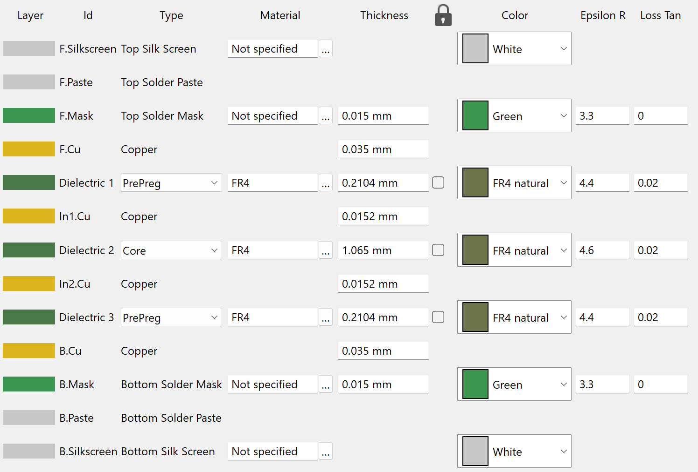

# Synchronising-Wand

## Introduction
The *Synchronising Wand* is an open-source hardware solution for synchronising multiple wireless inertial measurement unit sensors (IMU) using their onboard magnetometers. The device combines an ESP32-S3 micro-controller unit with an electromagnetic generator to create an encoded electromagnetic event which can be used to synchronise multiple IMU devices. The device also includes an onboard IMU, allowing the user to track the motion of the wand as well as perform a kinetic synchronising event.

The device includes an OLED display and 4 configuable push buttons for user interface to enhance the usability of the system. The device uses SD card as storage medium to store the synchronising data and onboard IMU data. WiFi is used to synchronise the RTC using SNTP from configurable NTP servers, e.g. *pool.ntp.org*.

## 3D Design Overview

## PCB Design
The PCB of the synchronising wand is designed using the open sourced PCB design software *KiCad*. The PCB files are completely open-sourced.

### Schematic

### Layout

### Stack-up Information
This device uses a 4 layer pcb, with a stack up of Signal-GND-GND-Signal.
The physical stack up of the pcb board is shown below:

